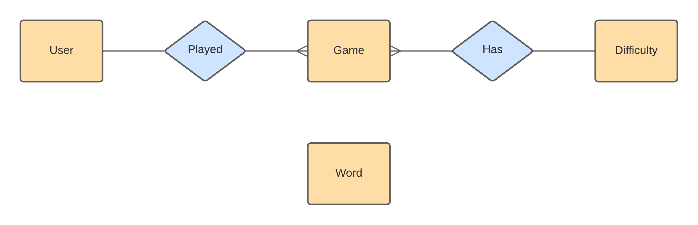

# Sype!

## Database (MariaDB)

**word**(<ins>id</ins>, text);\
**user**(<ins>id</ins>, nickname, hash, picture_url);\
**difficulty**(<ins>level</ins>, description, words_n);\
**game**(<ins>id</ins>, user_id*, difficulty_level*, datetime, result, errors_n);

## JSON API (PHP)

| Route                         | Methods | Description                             |
|-------------------------------|---------|-----------------------------------------|
| /words.php?difficulty=*level* | GET     | Get a random set of words by difficulty |
| /difficulties.php             | GET     | Get difficulties data                   |

## EXTRAS
- Random name generator (using sype.word table)
