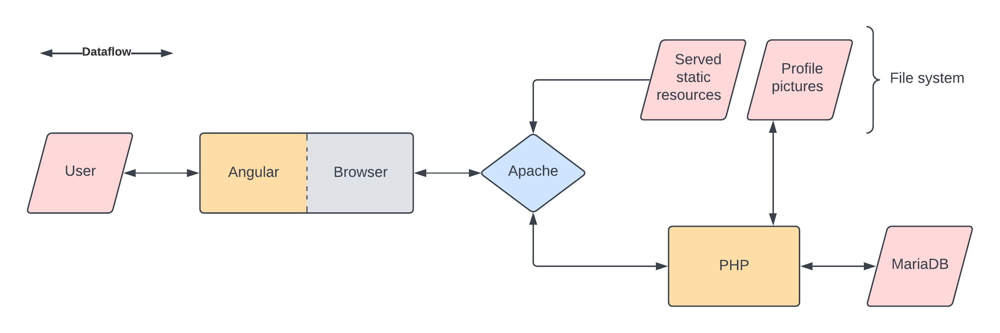

# Sype!

## Abstract

_Sype!_ is a typing test client-server application for web browsers.

_Sype!_ consists of 4 components:
- **Database**: MariaDB (SQL)
- **API**: PHP (JSON)
- **Web server**: Apache HTTP Server
- **Frontend**: Angular (HTML/CSS/TS)

## Database (MariaDB)

### Model

_word_(**id**, text) \
_user_(**id**, nickname, hash, picture_uri) \
_difficulty_(**id**, description, words_n) \
_game_(**id**, user_id*, difficulty_id*, datetime, result, errors_n)
> _entity_(**primary_key**, foreign_key*, attribute)

### CRUD
| Create | Read   | Update | Delete |
|--------|--------|--------|--------|
| INSERT | SELECT | UPDATE | DELETE |

### SQL scripts
- [Initializaton script](./src/database/sype.sql)
- [Wordlist](./src/database/words.sql)

## API (PHP)

### CRUD
| Create | Read | Update | Delete |
|--------|------|--------|--------|
| PUT    | GET  | PATCH  | DELETE |
> **Non-idempotent operations**: POST

### Routes
| Route                         | Methods                 | Description                                     |
|-------------------------------|-------------------------|-------------------------------------------------|
| /users.php?user=_nickname_    | PUT, GET, PATCH, DELETE | Create, get, modify and delete users            |
| /login.php                    | POST                    | Log in                                          |
| /pictures.php?user=_nickname_ | PUT, GET, PATCH, DELETE | Create, get, modify and delete profile pictures |
| /difficulties.php             | GET                     | Get difficulties informations                   |
| /words.php?difficulty=_level_ | GET                     | Get a random set of words by difficulty         |
| /games.php?user=_nickname_    | PUT, GET                | Create new games and get games by user          |
| /rankings.php                 | GET                     | Get rankings for each difficulty                |

## Extras

- Random name generator (using sype.word table)
- User research + dropdown
